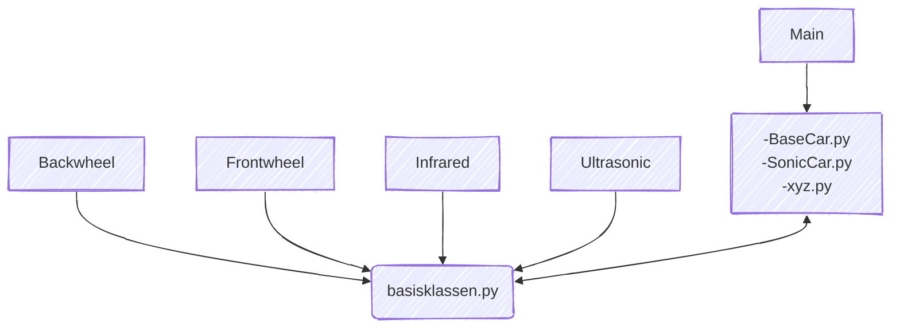

# Doku

```mermaid
---
config:
  theme: default
  look: handDrawn
---
flowchart TD
    roundedId["Backwheel"] --> B("basisklassen.py")
    n7["Frontwheel"] --> B
    n8["Infrared"] --> B

    n5["Ultrasonic"] --> B
    n10["Main"] --> n9["-BaseCar.py
    -SonicCar.py
-xyz.py"]
    n9 <--> B
    roundedId@{ shape: rect}
    n7@{ shape: rect}
    n8@{ shape: rect}
    n9@{ shape: rect}
    n5@{ shape: rect}

```

# Anpassung igiignore
git rm -r --cached .
git add .
git commit -m "Refreshed cache"

-> Neustart VSCode