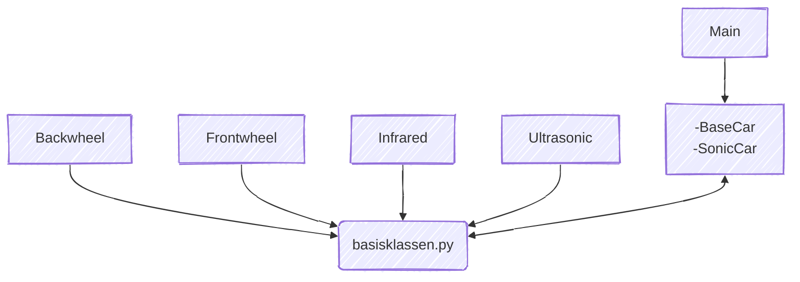

# Doku

```mermaid
---
config:
  theme: default
  look: handDrawn
---
flowchart TD
    roundedId["Backwheel"] --> B("basisklassen.py")
    n7["Frontwheel"] --> B
    n8["Infrared"] --> B

    n5["Ultrasonic"] --> B
    n10["Main"] --> n9["-BaseCar
    -SonicCar"]
    n9 <--> B
    roundedId@{ shape: rect}
    n7@{ shape: rect}
    n8@{ shape: rect}
    n9@{ shape: rect}
    n5@{ shape: rect}

```

