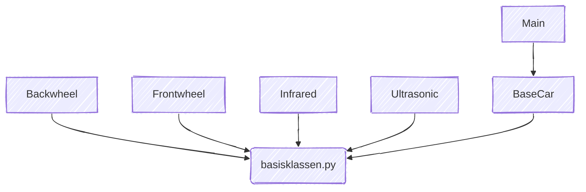

# doku: markdown
## tests werden nicht mehr gemacht genug für heute

Link zur Anleitung: https://docs.github.com/de/get-started/writing-on-github/getting-started-with-writing-and-formatting-on-github/basic-writing-and-formatting-syntax

Here is a simple flow chart:

